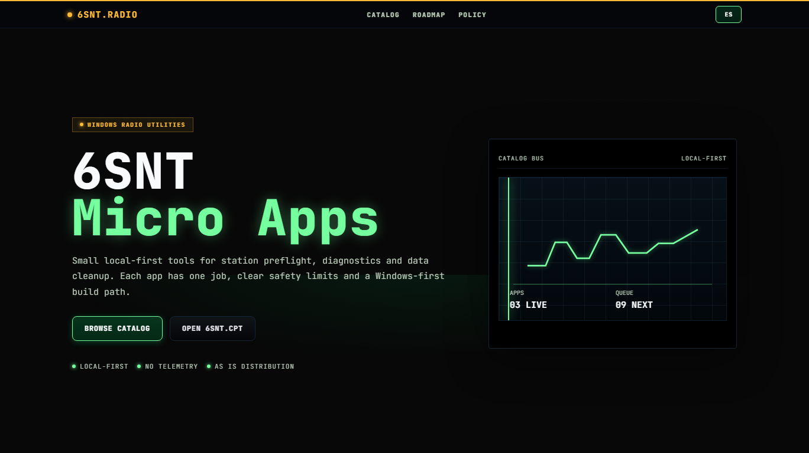

# 6SNT.MicroApps

Public catalog for small, local-first 6SNT radio utilities.

[](https://6snt-radio.github.io/6SNT.MicroApps/)




## Live Pages

Primary site:

```text
https://6snt-radio.github.io/6SNT.MicroApps/
```

Spanish:

```text
https://6snt-radio.github.io/6SNT.MicroApps/es/
```

## What This Is

`6SNT.MicroApps` is the catalog layer for focused station utilities. Each app should solve one operational problem: preflight, diagnostics, data cleanup, device checks or operator safety.

The portal is static and public. It shows app status, screenshots, release paths, safety notes and checksums without publishing private app source, binaries or local station data.

When a release already has a Windows executable, the app card and detail page expose a direct `Download EXE` link. Private app downloads can still require GitHub access.

## What This Is Not

This repository is not a monorepo for every app.

It does not contain release binaries, private source code, radio logs, ADIF files, credentials, local database files or station-specific captures.

## Current Catalog

| App | Purpose | Source | Channel |
| --- | --- | --- | --- |
| `6SNT.CPT` | CAT Port Guardian, read-only COM/CAT preflight for Windows | Private | Private release |
| `6SNT.UADL` | USB Audio Device Lock, read-only USB audio preflight for Windows | Private | Private prerelease |
| `6SNT.ADIF-HUB` | Local log cleanup and export staging | Public | Public prerelease |

## Safety Model

Radio-facing tools start read-only. A catalog entry must state whether the app can interact with serial ports, rig state, logs or external services.

Anything capable of PTT, TUNE, TX, CW, audio transmit or unattended automation must be documented as an explicit operator action with clear limits in the app repository before it is listed here.

## Distribution

Tools listed here are provided AS IS, without warranty and without any promise of future versions, maintenance, support or compatibility.

Use them on copies of important data first, verify behavior in your own station environment and keep backups before relying on any workflow.

## Adding An App

1. Add sanitized screenshots under `docs/assets/apps/<id>/`.
2. Add the English entry in `docs/data/apps.en.json`.
3. Add the optional Spanish entry in `docs/data/apps.es.json`.
4. Add a detail page under `docs/apps/<id>/` and, when translated, `docs/es/apps/<id>/`.
5. Preview locally and confirm links, images, language switch and mobile layout.

## Local Preview

```powershell
python -m http.server 4173 -d docs
```

Open:

```text
http://127.0.0.1:4173/
http://127.0.0.1:4173/es/
http://127.0.0.1:4173/apps/cpt/
http://127.0.0.1:4173/apps/uadl/
http://127.0.0.1:4173/apps/adif-hub/
```

## Troubleshooting

If the catalog cards are empty, check that the JSON files are valid and served from a local web server. Opening the HTML directly from disk can block `fetch()`.

If screenshots are missing, keep asset paths relative to the `docs/` root inside the JSON, for example `assets/apps/cpt/screenshot.png`.

If GitHub Pages shows an older version, wait for the Pages build to finish and hard-refresh the browser.

If a release or direct download link asks for access, the app may be private by design. The portal can be public while individual repositories and release assets remain restricted.

## Publishing

GitHub Pages should use:

```text
Branch: main
Folder: /docs
```

Do a filename-only sensitive-data scan before pushing and never add station data or release binaries to this repository.
